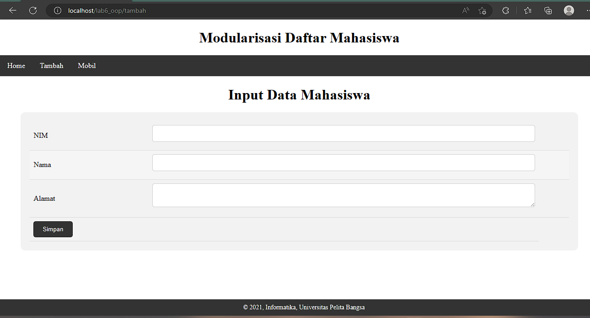

# PHP-OOP2
# PHP-Dasar

This project is an assignment from my class
#### NIM : 312110103
#### Kelas : TI.21.A2
#### MatKul : Pemrograman Weh 2

### Latihan
## Membuat Routing
### Routing digunakan untuk mempermudah akses halaman web agar SEO Friendly menggunakan Class Library

### Menggunakan .htaccess
```
<IfModule mod_rewrite.c>
 RewriteEngine On
 RewriteBase /lab6_oop/
 RewriteCond %{REQUEST_FILENAME} !-f
 RewriteCond %{REQUEST_FILENAME} !-d
 RewriteRule ^home/?$ module/home.php [L]
 RewriteRule ^tambah/?$ module/artikel/tambah.php [L]
 RewriteRule ^mobil/?$ module/mobil.php [L]
 RewriteRule ^ubah/?$ module/artikel/ubah.php [L]
 RewriteRule ^hapus/?$ module/artikel/hapus.php [L]
</IfModule>


```
### Hasil routing


### Tugas Mobil

### Test Penginputan data

